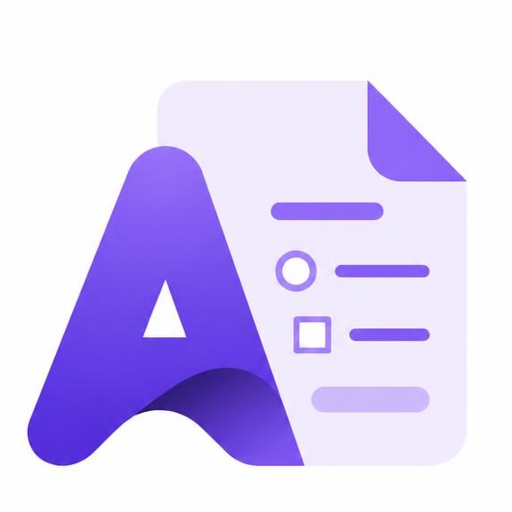
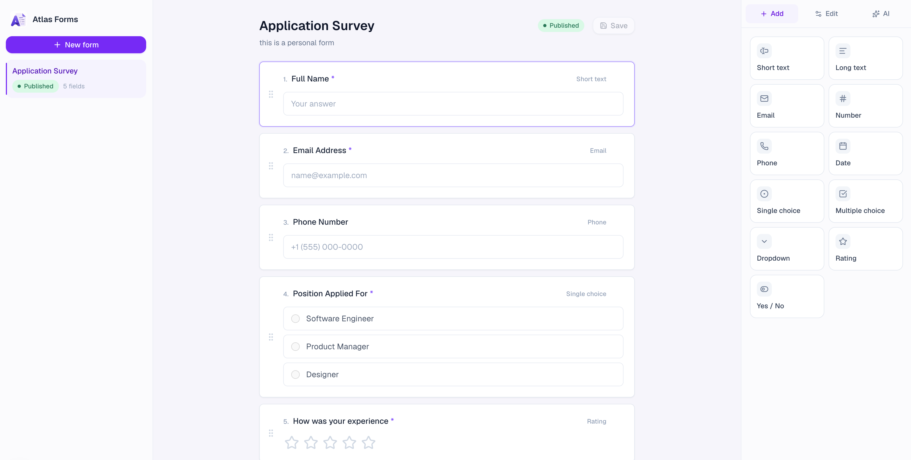
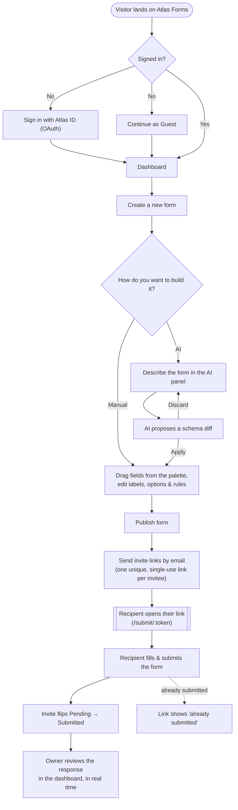
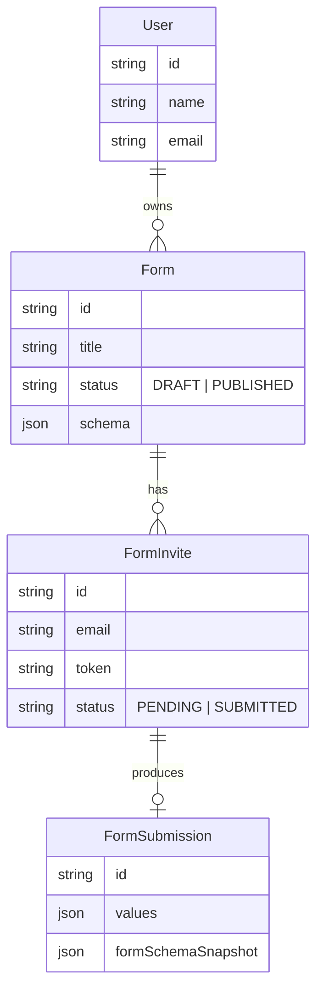

<div align="center">



# Atlas Forms

**Build every field by hand, or describe the form you need and let AI draft it for you.**

Manual control. AI when you want it.

[](https://nextjs.org)
[](https://react.dev)
[](https://www.typescriptlang.org)
[](https://www.prisma.io)
[](https://tailwindcss.com)
[](https://zustand-demo.pmnd.rs)



</div>

<br />

## What is this?

Atlas Forms is a form builder: drag fields onto a canvas by hand, or describe what you need in plain English and let AI draft a schema you can review, tweak, apply, or revert before it ever touches your live form. Publish a form, send single-use invite links by email, and watch responses land in real time — no duplicate submissions, no stale links.

## Features

- 🧩 **Manual builder** — a clean field palette, drag-to-reorder canvas, and a per-field editor for labels, placeholders, options, and validation rules.
- ✨ **AI co-pilot** — describe a form in natural language; the AI panel proposes a schema diff you explicitly apply or discard, never a silent overwrite.
- 🔗 **Publish & invite** — turn a draft into a live form in one click, then send unique, single-use links per invitee via email.
- 📊 **Response tracking** — invites move from `Pending` → `Submitted` live; open any response to see exactly what was answered against a snapshot of the form at submission time.
- 🔐 **Atlas ID auth** — sign in via Atlas ID's OAuth flow, or jump straight in with a disposable guest account.
- 🌗 **11 field types** — short text, long text, email, number, phone, date, single-select, multi-select, dropdown, rating, and yes/no.

## App flow



**In short:** land → sign in (Atlas ID or guest) → build a form (by hand or with AI) → publish → invite by email → recipient submits via a one-time link → response tracked back on the dashboard.

## Tech stack

| Layer | Choice |
| --- | --- |
| Framework | [Next.js 16](https://nextjs.org) (App Router, Turbopack) |
| UI | React 19, Tailwind CSS 4, Radix UI primitives, Framer Motion, `lucide-react` |
| State | Zustand (per-feature stores) |
| Drag & drop | `@dnd-kit` |
| Database | PostgreSQL via Prisma 7 (Neon serverless driver supported) |
| Auth | Atlas ID OAuth, JWT verification (`jose`) |
| AI | OpenAI (`gpt-4o-mini`, structured JSON schema generation) |
| Email | Brevo transactional email API |
| Validation | Zod |
| Testing | Vitest |

## Project structure

```
src/
├── app/                     # Next.js routes (App Router)
│   ├── page.tsx             # Marketing home page
│   ├── dashboard/           # Authenticated form builder workspace
│   ├── submit/[token]/      # Public, tokenized invite submission page
│   └── api/v1/              # Route handlers (forms, invites, ai, users)
├── features/
│   ├── home/                # Landing page: hero, features, nav, user menu
│   ├── dashboard/            # Sidebar, canvas, field editor, AI panel, invites
│   ├── auth/                 # Atlas ID session store, token utils, JWT verification
│   └── submission/           # Public-facing submission form + closed state
├── server/
│   ├── services/             # Business logic (FormService)
│   └── validation/            # Zod schemas for forms, fields, submissions
├── infra/                    # External integrations: DB, AI, mailer
├── shared/                   # Reusable UI kit (Button, Modal, Badge, …) & utils
└── lib/http/                 # Axios instances (internal API + Atlas ID)
```

## Getting started

### 1. Install dependencies

```bash
npm install
```

### 2. Configure environment

Copy `.env.example` to `.env` and fill in the values:

```bash
cp .env.example .env
```

| Variable | Purpose |
| --- | --- |
| `DATABASE_URL` | PostgreSQL connection string |
| `NEXT_PUBLIC_AUTH_URL` | Atlas ID auth service origin |
| `NEXT_PUBLIC_API_URL` | This app's own public origin |
| `NEXT_PUBLIC_CLIENT_ID` | Atlas ID OAuth client id |
| `JWT_PUBLIC_KEY` | Public key used to verify Atlas ID access tokens |
| `OPENAI_API_KEY` | Powers the AI form-generation panel |
| `BREVO_API_KEY` / `BREVO_SENDER_EMAIL` | Sends invite emails |

### 3. Set up the database

```bash
npm run db:generate   # generate the Prisma client
npx prisma db push    # sync the schema to your database
```

### 4. Run the dev server

```bash
npm run dev
```

Open [http://localhost:3000](http://localhost:3000).

> Atlas Forms delegates sign-in to a separate Atlas ID auth service (`NEXT_PUBLIC_AUTH_URL`). Run that service locally too, or use "Continue as Guest" to skip OAuth entirely.

## Scripts

| Command | Description |
| --- | --- |
| `npm run dev` | Start the dev server (Turbopack) |
| `npm run build` | Generate the Prisma client and build for production |
| `npm run start` | Run the production build |
| `npm run lint` | Lint the codebase |
| `npm run db:generate` | Regenerate the Prisma client |
| `npm run db:pull` | Pull the schema from the database |

## Data model



Every submission stores a `formSchemaSnapshot` alongside the answers, so responses stay readable even after the live form schema changes later.
